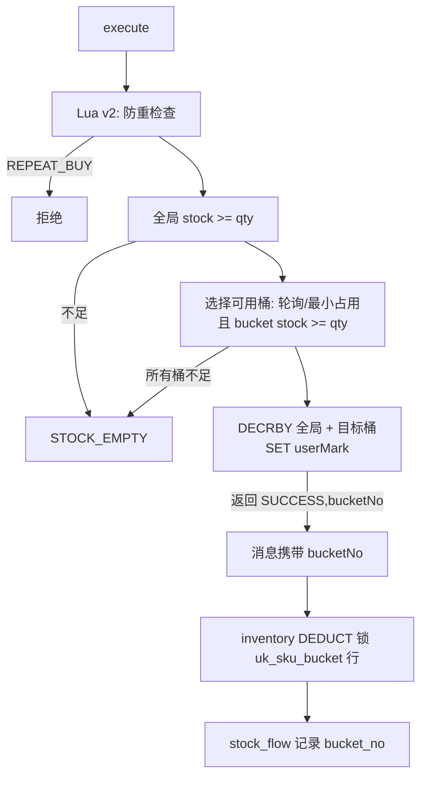

# Phase 6.2 Inventory 热点库存方案设计（评审稿）

> 版本：v0.1（评审用）
> 状态：分析 + 设计 + benchmark 准备；**未经评审不修改数据库结构 / Redis Key / 状态机 / 业务代码**
> 关联：Phase 6.0 性能分析（冻结）、Phase 6.1 实测（order 269 QPS / combined 109.87 QPS / 单 SKU 行锁 110-124 QPS）

---

## 1. 当前库存模型分析

### 1.1 现状链路

```mermaid
flowchart LR
    U[用户 HTTP execute] --> A[Redis Lua 预扣<br/>seckill:stock:{skuId}--<br/>seckill:user:{skuId}:{userId} 标记]
    A -->|成功| T[RocketMQ 事务消息<br/>pre_deduct INIT→SUCCESS]
    T --> O[order-service 建单<br/>idempotent + order + order_item]
    O --> C[pre_deduct CONFIRMED 回填]
    O --> M[CREATE_ORDER]
    M --> I[inventory confirmDeduct<br/>SELECT ... FOR UPDATE + CAS + stock_flow]
    I -->|失败| E[业务异常：事实不足/不存在/冲突]
    U -->|取消/超时| R[inventory recoverStock<br/>FOR UPDATE + CAS + stock_flow RECOVER]
    R --> RC[Redis recover 内部接口<br/>seckill:stock 回补]
```

### 1.2 关键事实（冻结代码盘点）

| 层 | 现状 | 位置 |
| --- | --- | --- |
| Redis | `seckill:stock:{skuId}`（全局库存）、`seckill:stock:total:{skuId}`、`seckill:user:{skuId}:{userId}`（防重）、`seckill:recover:{requestId}`（回补幂等） | RedisStockService + Lua v1.0 |
| MySQL 事实 | `inventory` 每 SKU 单行：total / locked / available / version（uk_sku） | V1.0__init.sql |
| 流水 | `stock_flow`：flow_no / uk_biz(biz_type,biz_id) 幂等，DEDUCT/RECOVER/REPAIR | StockFlowService |
| 扣减 | `confirmDeduct`：exists 幂等 → SELECT FOR UPDATE → CAS UPDATE → flow INSERT（单事务） | InventoryServiceImpl |
| 恢复 | `recoverStock`：exists 幂等 → FOR UPDATE → CAS UPDATE → flow INSERT → HTTP 回补 Redis | InventoryServiceImpl + StockRecoverInternalController |
| 对账 | total=locked+available、RECOVER≤DEDUCT、REPAIR 修复 | ReconciliationService |

### 1.3 热点在哪里

- **入口热点**：Redis 单 key `seckill:stock:{skuId}`。Redis 单 key 原子操作本身可达数万 QPS，**不是瓶颈**（L-02 实测 1847 QPS 时 Redis 仍正常）。
- **事实热点**：`inventory` 表 `uk_sku` 单行。全部 DEDUCT 都命中同一行，`SELECT ... FOR UPDATE` 使事务串行化。
- **恢复热点**：同一行的 RECOVER 同样串行化（Phase 5.5.4 已按 FOR UPDATE 修复）。

### 1.4 为什么 consumer 并发无法提升

Phase 6.1 线程矩阵（5000 条、单 SKU）：

| inventory 线程 | inventory 链路 QPS | 结论 |
| --- | --- | --- |
| 4 | 96.03 | 已接近行锁上限 |
| 8 | 109.22 | 最优档 |
| 20 | 97.05 | 持平，线程增加无收益 |

单消息事务（SELECT FOR UPDATE → UPDATE → flow INSERT → COMMIT）实测 8-10 ms，折算行锁串行上限 ≈110-124 QPS。**线程再多也只是排队等同一把行锁**。

### 1.5 为什么批处理无法解决

- 批量消费（consumeMessageBatchMaxSize）只减少消息调度开销，DEDUCT 仍逐条持有同一行锁；
- 若批量合并为一个事务，则打破“每条消息独立幂等 / 单订单状态正确 / 单事务 DEDUCT”冻结语义；
- Phase 6.1 已评估并否决（见 inventory-hotspot-analysis.md）。

### 1.6 当前模型最大理论吞吐

- 单行：≈110-124 QPS（实测 123.86 QPS / 2000 条收敛 16.1s）。
- 5000 条收敛理论下界 ≈40s（与 Phase 6.1 实测 45.5s 吻合）。
- **目标 O-01（≥300 QPS）与 O-02（5000 条 ≤25s）在单行模型下不可达**，必须解除单行锁。

---

## 2. 优化方案设计

### 方案 A：库存分片（SKU Stock Sharding）——推荐候选

#### A.1 数据模型

评审后实施（当前不动 DDL）：

```sql
-- 库存事实分桶表（新增；inventory 保留为 SKU 汇总/迁移兼容）
CREATE TABLE inventory_bucket (
    id              BIGINT NOT NULL COMMENT '主键（Snowflake）',
    sku_id          BIGINT NOT NULL,
    bucket_no       INT    NOT NULL COMMENT '桶号 0..N-1',
    total_stock     INT    NOT NULL COMMENT '本桶总库存',
    locked_stock    INT    NOT NULL DEFAULT 0,
    available_stock INT    NOT NULL,
    version         INT    NOT NULL DEFAULT 0,
    created_at      DATETIME(3) NOT NULL DEFAULT CURRENT_TIMESTAMP(3),
    updated_at      DATETIME(3) NOT NULL DEFAULT CURRENT_TIMESTAMP(3) ON UPDATE CURRENT_TIMESTAMP(3),
    deleted         TINYINT NOT NULL DEFAULT 0,
    PRIMARY KEY (id),
    UNIQUE KEY uk_sku_bucket (sku_id, bucket_no)
) COMMENT='库存事实分桶（Phase 6.2 评审后实施）';

-- stock_flow 增加桶定位列（评审后 ALTER）
ALTER TABLE stock_flow ADD COLUMN bucket_no INT DEFAULT NULL COMMENT 'DEDUCT/RECOVER 命中桶';
ALTER TABLE stock_flow ADD KEY idx_sku_bucket (sku_id, bucket_no);
```

`inventory` 单行保留为 SKU 汇总视图（total 权威），由分桶 SUM 一致性校验；**对账与 REPAIR 以分桶行为事实**。

#### A.2 Redis Key 设计

保持现有全局 key 不变（入口契约零变更）：

| Key | 作用 | 变更 |
| --- | --- | --- |
| `seckill:stock:{skuId}` | 全局准入库存 | 不变 |
| `seckill:stock:total:{skuId}` | 全局总库存 | 不变 |
| `seckill:user:{skuId}:{userId}` | 防重标记 | 不变 |
| `seckill:bucket:{skuId}:{bucketNo}` | 分桶可用库存（新） | 新增，Lua 原子维护 |
| `seckill:recover:{requestId}` | 回补幂等 | 不变 |

#### A.3 扣减路径（Lua 扩展，评审后实施）



- Lua 返回 `(SUCCESS, bucketNo)`（脚本返回字符串如 `"1:3"` 或数组，Spring 端解析；当前 `DefaultRedisScript<Long>` 需适配为解析器）。
- 桶选择策略：**轮询（round-robin）优先**，其次最小占用；保证初始均分、长期均衡，避免 hash 倾斜。
- 消息扩展：`CREATE_ORDER` 增加可选字段 `bucketNo`；**旧消息无该字段时回退单桶**（N=1 或扫描），保证兼容与回滚。

#### A.4 恢复路径

- `stock_flow.bucket_no` 记录 DEDUCT 命中桶；RECOVER 按该桶行 `FOR UPDATE` + CAS。
- Redis 回补：内部 recover 接口扩展可选 `bucketNo`；缺失时按 SKU 全桶扫描恢复（向后兼容）。
- 用户防重标记：维持冻结契约（recover 不清理用户标记，现有边界不变）。

#### A.5 对账与修复

- `check(skuId)`：SUM(inventory_bucket) 与 `inventory` 汇总行比对（total/locked/available）；流水数校验沿用。
- `repair`：目标差额在桶间重分配（默认均分到各桶），REPAIR 流水记录桶号。

#### A.6 优点 / 风险

| 优点 | 风险 | 缓解 |
| --- | --- | --- |
| 行锁竞争下降 N 倍（实测 4 行 379 QPS / 8 行 500 QPS） | DDL + 存量数据迁移 | 新表上线 + 存量 SKU 后台分桶任务 |
| 多消费者真正并行 | Redis Lua 多 key 变更 | 保持单脚本原子性；灰度 N=1→4→8 |
| 对账不变量可聚合验证 | 消息契约扩展 | 字段可选 + 旧消息回退 |
| 回滚成本低 | 桶倾斜导致单桶提前空 | 轮询 + Lua 侧检查 + MySQL 侧兜底 |

### 方案 B：库存预扣确认模型优化（扩大 Redis 缓冲层）

**思路**：保持 Redis Lua 预扣不变，MySQL 确认异步化/合并（如按批次落差额）。

- 优点：可进一步降低 MySQL 写频率；Redis 缓冲吸收突发。
- 风险：
  1. MySQL 最终事实源地位弱化，出现“Redis 已扣、MySQL 未确认”长窗口；
  2. 订单状态与库存事实不一致窗口扩大，故障恢复依赖重放/补偿；
  3. 幂等与对账复杂度显著上升，与“MySQL 为最终库存事实源”冻结设计冲突。
- 结论：**不作为主方案**。方案 A 中的分桶计数本质即 Redis 缓冲层的受控扩展，收益已覆盖。

### 方案 C：库存流水异步化

**思路**：DEDUCT 事务内只做库存状态变更，`stock_flow` 异步落库。

- 收益估算：单事务减少 1 次 INSERT（约 1-3 ms），单行上限从 ~124 提升到 ~150-180 QPS，**仍不满足 300 QPS 目标**。
- 风险：`uk_biz` 幂等原子性从库存变更事务中剥离，崩溃后流水缺失影响对账/审计；需另设幂等键与补偿，改造面大于收益。
- 结论：**不采用**（可作为 A 实施后的可选配套，需独立设计幂等与补偿）。

### 方案 D：保持当前模型，SQL/索引/事务优化

| 候选 | 收益评估 | 结论 |
| --- | --- | --- |
| 去掉 exists 幂等查询（uk_biz 已保证） | 每事务 -1 查询，约 5-10% | 可做，收益小 |
| 索引优化 | 行锁竞争与索引无关 | 无效 |
| 缩小事务范围 | 已最小（1 行 + 1 流水） | 无效 |
| 去掉 FOR UPDATE 改条件 UPDATE | 回到 CAS 竞争/饥饿（Phase 5.3.2 已修复） | 禁止 |

- 结论：**收益不足**（~10-30%），无法突破单行锁上限；可作为方案 A 的轻量配套，但不应作为主方案。

---

## 3. 推荐方案

### 3.1 方案：A（库存分桶）+ D 轻量配套

**依据（Phase 6.2 H-01 基准实测）**：

| 独立库存行（模拟桶） | consume QPS | 2000 条收敛 | row_lock_waits 增量 | 死锁 |
| --- | --- | --- | --- | --- |
| 1 | 123.86 | 16.1 s | 1999 | 0 |
| 4 | 379.00 | 5.3 s | 1662 | 0 |
| 8 | 499.88 | 4.0 s | 1153 | 0 |
| 16 | 479.50 | 4.2 s | 635 | 0 |

**结论**：4-8 桶即可达到 300+ QPS；8 桶可支持 5000 条 ≤15s（O-01/O-02 达标），且死锁保持 0。

### 3.2 实施分期（评审通过后）

| 阶段 | 内容 | 门禁 |
| --- | --- | --- |
| 6.2.1 | DDL（inventory_bucket + stock_flow.bucket_no）、Redis Lua v2、消息字段、DEDUCT/RECOVER/对账改造、N 配置（默认 1） | 单测 + H-02 一致性 |
| 6.2.2 | 灰度 N=4/8；H-01 真实分桶复测 | consume QPS ≥300、5000 ≤25s |
| 6.2.3 | H-03 故障 + H-04 全量回归 + L-01~L-05 | 281/30/13/压测全 PASS |

### 3.3 收益 / 风险 / 回滚 / 验证指标

| 项目 | 内容 |
| --- | --- |
| 收益 | 行锁竞争 N 倍下降；consume QPS 124→379+（4 桶）；5000 条收敛 ≤25s |
| 风险 | DDL 迁移、Lua 契约变更、桶倾斜、对账复杂度（见 §6 风险矩阵） |
| 回滚 | N=1 等效现状；旧消息无 bucketNo 自动回退；inventory 表不动、新表可弃；配置开关一键关闭分桶 |
| 验证指标 | consume QPS、5000 收敛、零超卖、available+locked=total、deadlock=0、幂等/恢复/对账全 PASS |

---

## 4. 数据一致性设计

### 4.1 Redis stock = MySQL available

- 扣减：Lua 原子 DECRBY 全局 + 目标桶；MySQL DEDUCT 成功后不写 Redis（与现状一致，Redis 侧在预扣阶段已扣）。
- 恢复：MySQL RECOVER 成功后经内部 recover 接口回补对应桶 key 与全局 key；回补幂等 `seckill:recover:{requestId}`。
- 对账：`Σ bucket.available == Redis stock` 由修复任务校验；REPAIR 后同步 Redis。

### 4.2 available + locked = total

- 不变量在每个桶行内维护（total=available+locked），SKU 维度由 SUM 聚合验证；
- `inventory` 汇总行与分桶 SUM 定期比对，不一致触发 REPAIR 告警。

### 4.3 订单数量 ≤ 库存数量（零超卖）

三重防线：
1. Redis 全局 Lua：`stock >= qty`；
2. Redis 桶 Lua：目标桶 `bucketStock >= qty`（避免 MySQL 端桶不足拒扣）；
3. MySQL 桶行：`SELECT FOR UPDATE` + `available >= qty` + CAS（最终事实校验）。

任一层失败即拒绝，不存在“Redis 放行、MySQL 拒扣后订单已建”的不一致（若出现，走冻结差异告警 + 对账 REPAIR，与现状一致）。

### 4.4 重复消息只产生一次效果

- `stock_flow.uk_biz(biz_type, biz_id)` 幂等保持不变，重复 DEDUCT/RECOVER 返回既有 flow_no；
- 消息 `messageId/orderId` 语义不变，新增 `bucketNo` 仅作为定位字段，不影响幂等键；
- 分桶后重复消息按既有 flow.bucket_no 定位，不会二次扣减。

### 4.5 取消恢复正确

- DEDUCT 流水记录 bucket_no → RECOVER 精确回补同一桶（行锁只作用于该桶，恢复吞吐同样按桶并行）；
- Redis 全局与桶 key 同步回补，超 total 由 recover Lua OVER_TOTAL 拒绝（现状语义不变）。

### 4.6 故障恢复可 repair

- Redis 丢失：预热任务按 `inventory` 汇总/分桶 SUM 重建全局与桶 key；
- MySQL 与 Redis 偏差：对账任务输出差额，REPAIR 按桶分配并记录 REPAIR 流水；
- consumer crash：RocketMQ 重投 + uk_biz 幂等 + flow.bucket_no 定位，确保只生效一次。

---

## 5. Phase 6.2 验证计划

### H-01 Inventory Sharding Benchmark

- 目标：验证“库存事实行数 × 吞吐”（单 SKU vs 多 bucket）。
- 状态：**benchmark 已准备并完成预跑**（`InventoryShardingBenchmark`，@LoadTest 默认跳过）：
  - 1/4/8/16 独立行：123.86 / 379.00 / 499.88 / 479.50 QPS；死锁 0。
  - 评审后对真实分桶模型重跑（同一报告格式 `L-06-SHARDING.json|csv`）。
- 指标：consume QPS、converge、row_lock_waits、deadlocks、TPS。

### H-02 Consistency Regression

- 10000 库存、高并发扣减（≥500 并发）→ 恢复（取消/超时）→ 对账。
- 断言：零超卖；`Σ available + Σ locked = total`；`Redis stock == Σ available`；流水 DEDUCT=成功数、RECOVER=回补数；幂等只生效一次。

### H-03 Failure Test

- Redis 异常：预扣快速失败、无订单/无 MQ/无脏库存；恢复后预热 + 对账一致。
- MQ 重复：CREATE_ORDER/CANCEL_ORDER 重复投递只生效一次。
- consumer crash：重投后按 flow.bucket_no 幂等恢复。

### H-04 Full Regression

- Unit 281+（含新增分桶单测）、Integration 30+、Chaos 13、L-01~L-05 全部 PASS；
- Release Gate PASS。

---

## 6. 风险矩阵

| 风险 | 概率 | 影响 | 缓解 | 回滚 |
| --- | --- | --- | --- | --- |
| DDL/存量迁移失败 | 中 | 高 | 新表 + 后台分桶任务 + 迁移演练 | 弃新表，原 inventory 不动 |
| Lua v2 多 key 原子性缺陷 | 低 | 高 | 单脚本原子 + 分桶单元测试 + 灰度 N=1 | 切回 Lua v1 |
| 桶倾斜（某桶先空） | 中 | 中 | 轮询 + 最小占用选择；Lua 兜底换桶 | 临时 N 调大/重建分桶 |
| 消息契约扩展兼容 | 低 | 中 | 字段可选 + 旧消息回退单桶 | 不兼容字段不发 |
| 对账复杂度上升 | 中 | 中 | 聚合视图 + 自动化对账测试 | 保留单桶对账路径 |
| 恢复路径桶定位错误 | 低 | 高 | flow.bucket_no 唯一事实 + 回归 | 按 SKU 全桶扫描恢复 |
| 性能未达标 | 中 | 中 | H-01 预跑已证明 4-8 桶达标 | N 参数调整 |

---

## 7. 结论与评审决策点

1. **是否批准方案 A（分桶）作为 Phase 6.2 主方向**；
2. **是否批准 Redis Lua v2 + CREATE_ORDER 消息扩展（bucketNo 可选）**；
3. **是否批准 DDL（inventory_bucket + stock_flow.bucket_no）与存量分桶迁移计划**；
4. 桶数默认值建议：N=8（实测 500 QPS，留有余量），灰度路径 N=1→4→8；
5. 明确不做：方案 B 扩大缓冲、方案 C 流水异步、SKU 之外的状态机/订单/支付改动。

评审通过前，仅允许 H-01 benchmark 测试代码存在（已提交），**不修改任何生产代码与数据模型**。
